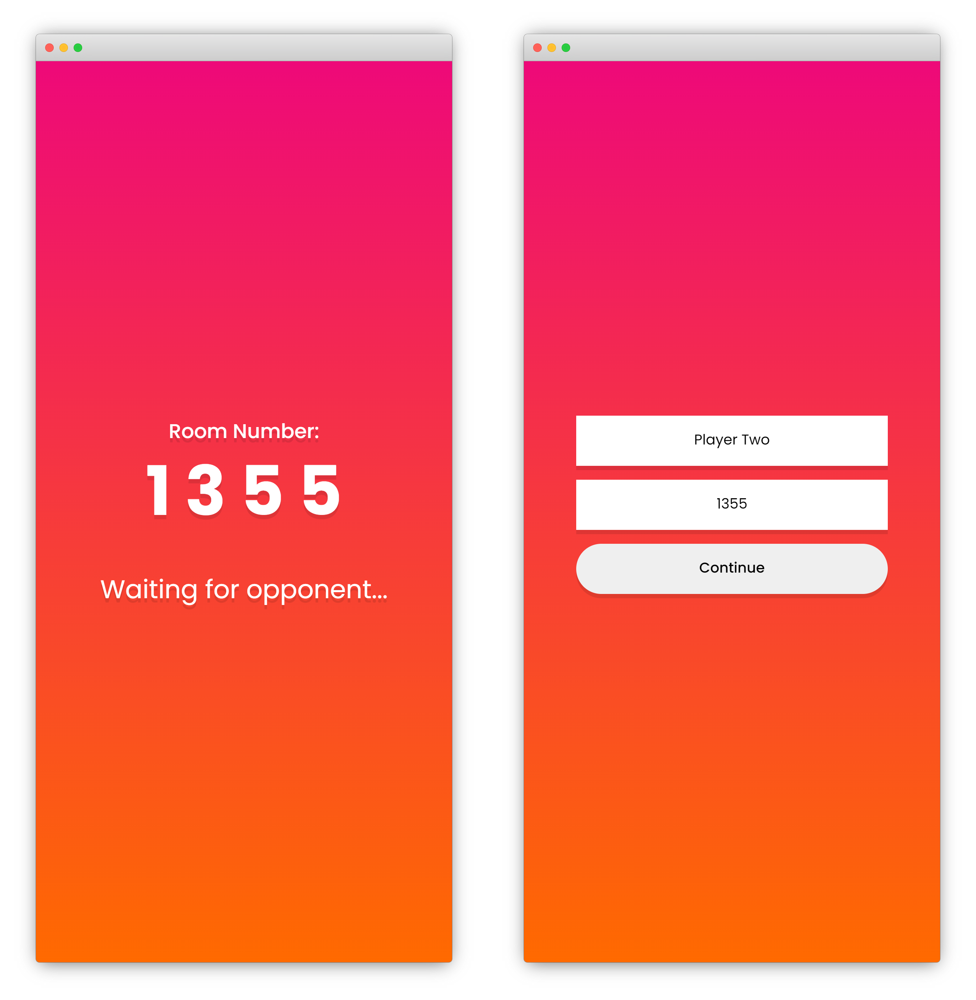
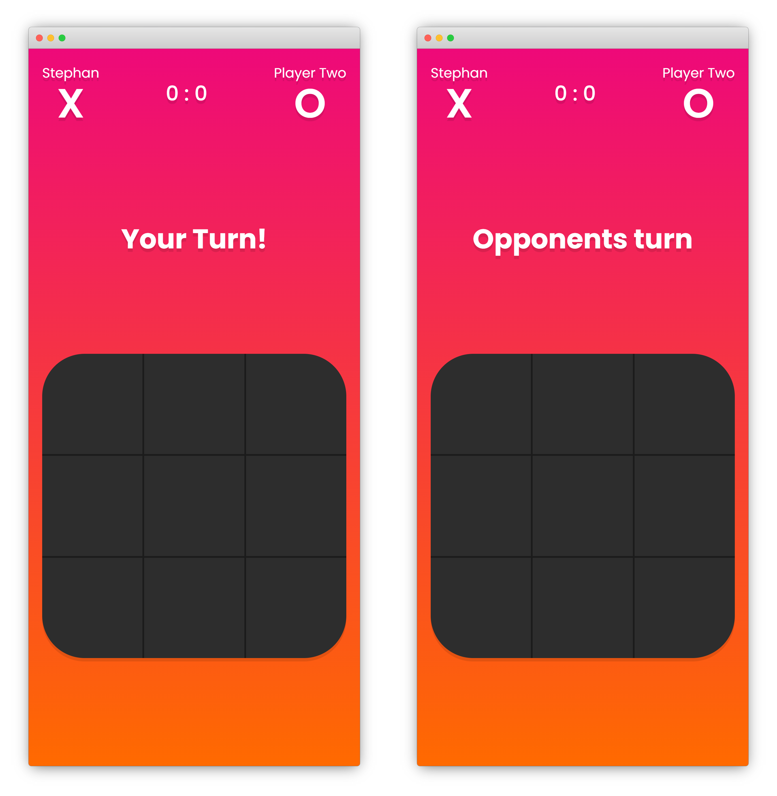
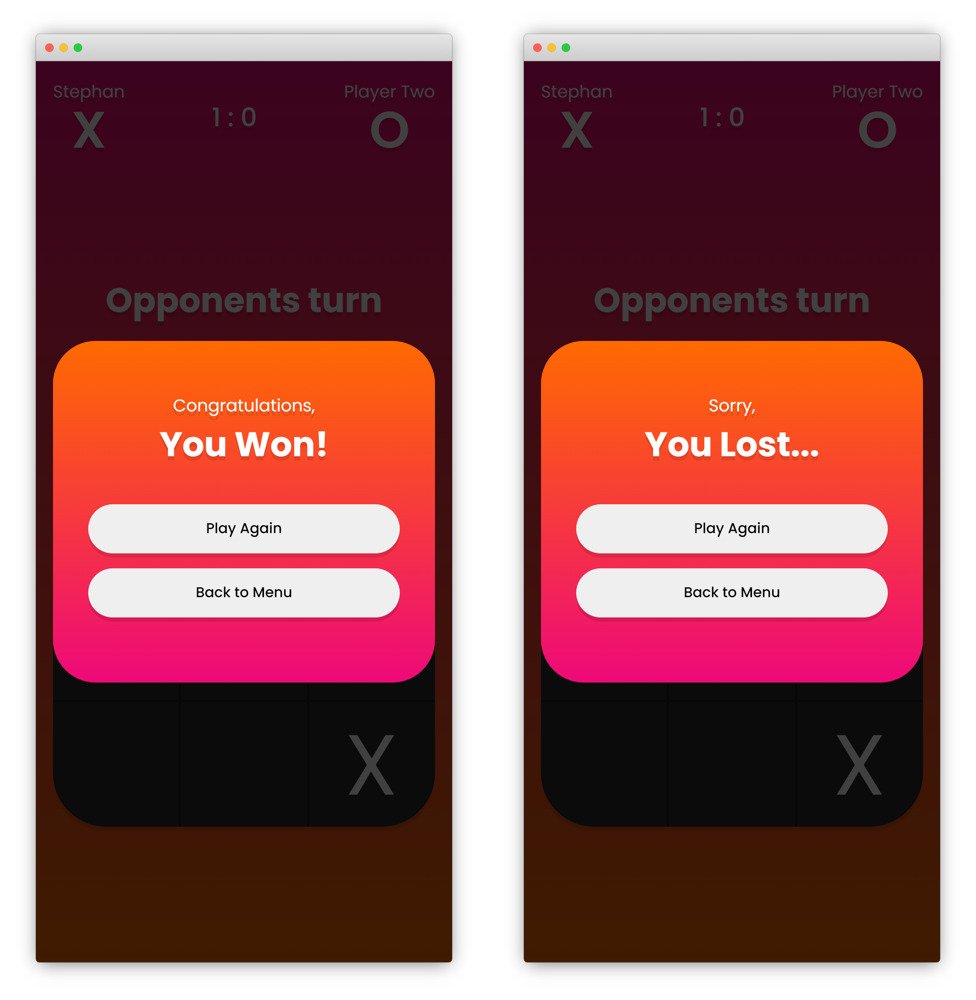

# Tic Tac Toe
2-player Tic Tac Toe game made using Socket.io, react, and express. 

[Deployed demo](http://stephan-tictactoe.herokuapp.com/) (Might take some time for first load due to Heroku)


## How to play:
```bash
1. Open in 2 tabs, or find a friend to play with.
2. Player one click "Create Match", enters a nickname and gets a random 4-digit room-number.
3. Player two joins by clicking "Join Match", entering a nickname, and the room-number player one created.
4. When both players are in, the game starts, and player one will get the first move.
```


## Features

```bash
- If one player closes browser or goes back to menu, the other player will be alerted.
- Round-starter switches each round
- If scoreboard is full, a "tie" will be triggered.
- If a player tries to join a room that already has 2 players, an alert will pop up that the room is full.
- If a player tries to join a room that doesnt exist, an alert will pop up that the room is not found.
```


## Illustrations






